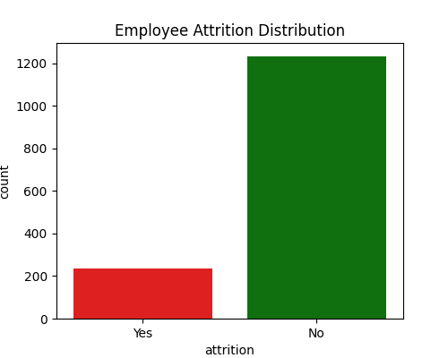
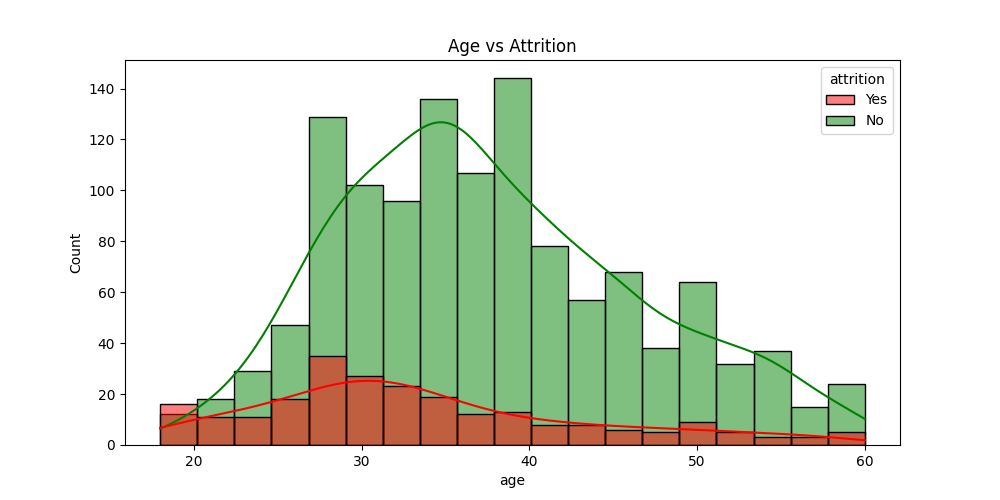
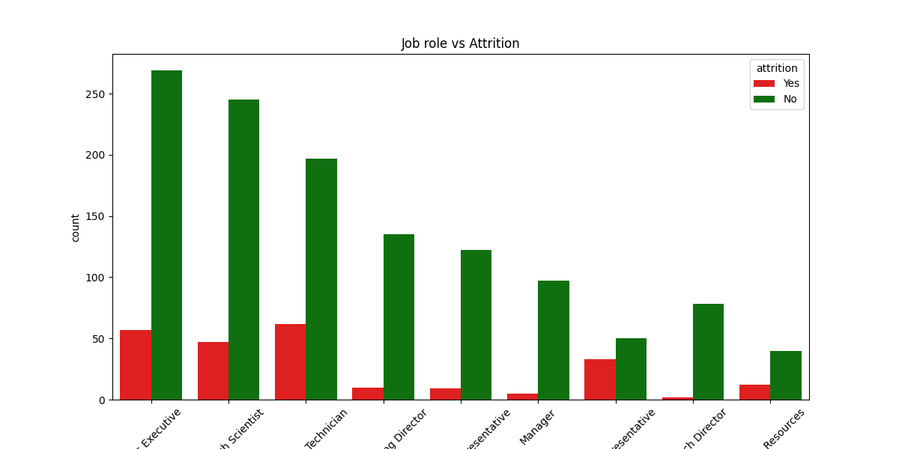
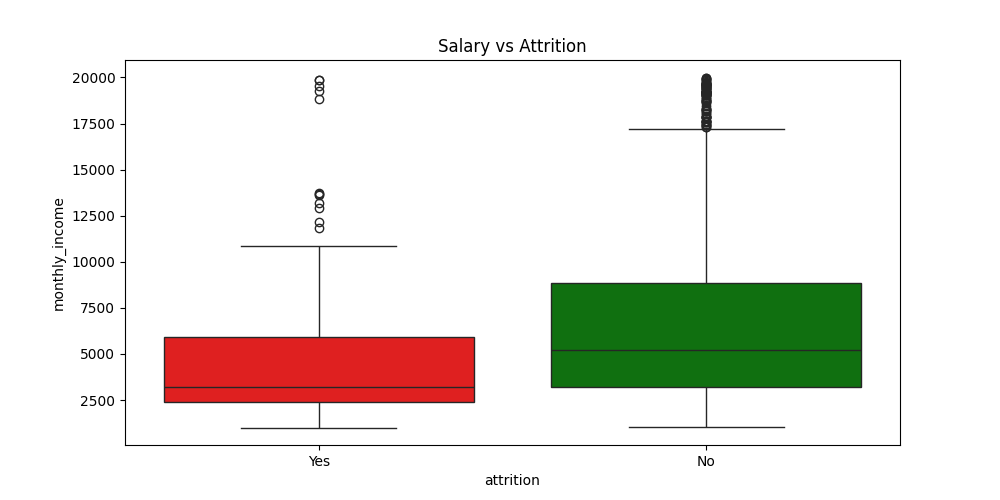
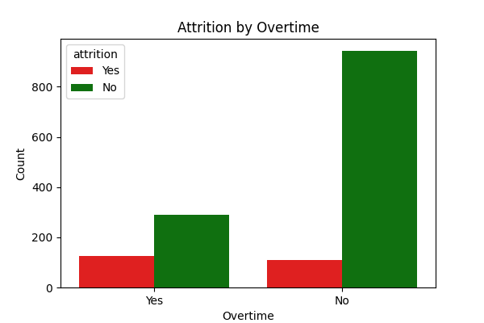
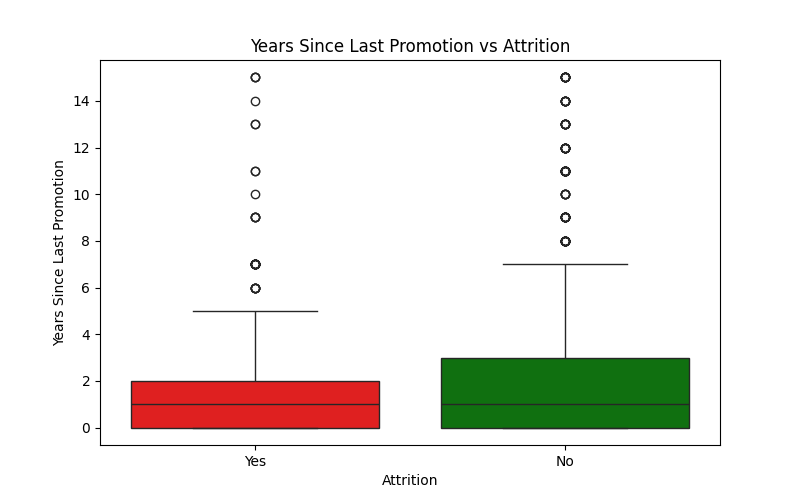

#  HR Attrition Analysis

###  **Project Overview**
Employee attrition is a critical issue for businesses. This project analyzes HR data to **identify key factors that contribute to employee turnover** and provides **actionable insights** to reduce attrition.

###  **Dataset**
- **Source:** [IBM HR Analytics Employee Attrition Dataset](https://www.kaggle.com/datasets/pavansubhasht/ibm-hr-analytics-attrition-dataset?resource=download)
- **Size:** 1,470 employees, 35 features
- **Target Variable:** `Attrition` (Yes/No)

---

##  **Key Insights from the Analysis**
✔ Younger employees (20-30) leave more frequently  
✔ Sales Representatives & Lab Technicians have the highest attrition  
✔ Employees with **low salaries** & **high overtime** leave more  
✔ **Lack of career growth & promotions** increases attrition risk  
✔ Poor **work-life balance** contributes to employee turnover  

---

##  **Visualizations**
###  Attrition Distribution  

###  Age vs Attrition  

###  Job Role vs Attrition  

###  Salary vs Attrition  

###  Overtime vs Attrition  

###  Promotion & Career Growth vs Attrition  

---

##  **Technologies Used**
- **Python** (Pandas, Seaborn, Matplotlib)
- **Google colab**
- **Git & GitHub for Version Control**

---

##  **HR Recommendations**
✅ **Improve work-life balance** (flexible work, remote options)  
✅ **Increase salaries** for high-risk job roles  
✅ **Reduce excessive overtime** to prevent burnout  
✅ **Create clear career growth & promotion plans**  

---

Contact
Author: Raj Kamal Maheria
Email: raj.maheria@gmail.com
LinkedIn: www.linkedin.com/in/raj-kamal-maheria

If you found this project useful, please give it a star! 
